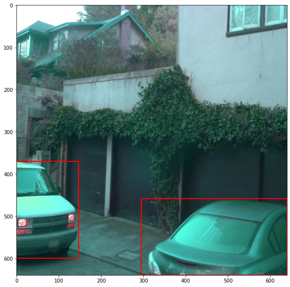

# Explore data augmentations

This notebook will be used to test different data augmentation strategies. In your config file, you can modify the augmentations by adding `data_augmentation_options`. For example, I would like to add a random RGB to gray transform with a probability of 0.2:
```
data_augmentation_options {
    random_rgb_to_gray {
    probability: 0.2
    }
```

A complete list of augmentation is provided the [`preprocessor.proto` file of the Tf Object Detection API](https://github.com/tensorflow/models/blob/master/research/object_detection/protos/preprocessor.proto).

### Helper functions


```python
import matplotlib.pyplot as plt
import numpy as np
from matplotlib.patches import Rectangle
```


```python
def recenter_image(image):
    # ssd preprocessing
    image += [123.68, 116.779, 103.939]
    return image

def display_instances(image, bboxes, classes):
    image = recenter_image(image)
    w, h, _ = image.shape
    # resize the bboxes
    bboxes[:, [0, 2]] *= w
    bboxes[:, [1, 3]] *= h
    
    f, ax = plt.subplots(1, figsize=(10, 10))
    ax.imshow(image.astype(np.uint8))
    for bb, cl in zip(bboxes, classes):
        y1, x1, y2, x2 = bb
        rec = Rectangle((x1, y1), x2-x1, y2-y1, facecolor='none', edgecolor='r', linewidth=2)
        ax.add_patch(rec)
    plt.show()

def display_batch(batch):
    # get images, bboxes and classes
    batched_images = batch[0]['image'].numpy()
    batched_bboxes = batch[1]['groundtruth_boxes'].numpy()
    batched_classes = batch[1]['groundtruth_classes'].numpy()
    num_bboxes = batch[1]['num_groundtruth_boxes'].numpy()
    batch_size = batched_images.shape[0]
    for idx in range(batch_size):
        display_instances(batched_images[idx, ...], 
                          batched_bboxes[idx, :num_bboxes[idx], :],
                          batched_classes[idx, ...])
```

### Display augmentations


```python
from utils import get_train_input
```


```python
train_dataset = get_train_input("pipeline_new.config")
```

    INFO:tensorflow:Reading unweighted datasets: ['../DATA/processed/train/segment-10517728057304349900_3360_000_3380_000_with_camera_labels.tfrecord', '../DATA/processed/train/segment-10596949720463106554_1933_530_1953_530_with_camera_labels.tfrecord', '../DATA/processed/train/segment-10072231702153043603_5725_000_5745_000_with_camera_labels.tfrecord', '../DATA/processed/train/segment-10750135302241325253_180_000_200_000_with_camera_labels.tfrecord', '../DATA/processed/train/segment-10588771936253546636_2300_000_2320_000_with_camera_labels.tfrecord', '../DATA/processed/train/segment-10724020115992582208_7660_400_7680_400_with_camera_labels.tfrecord', '../DATA/processed/train/segment-10676267326664322837_311_180_331_180_with_camera_labels.tfrecord', '../DATA/processed/train/segment-11355519273066561009_5323_000_5343_000_with_camera_labels.tfrecord', '../DATA/processed/train/segment-10096619443888687526_2820_000_2840_000_with_camera_labels.tfrecord', '../DATA/processed/train/segment-1051897962568538022_238_170_258_170_with_camera_labels.tfrecord', '../DATA/processed/train/segment-11799592541704458019_9828_750_9848_750_with_camera_labels.tfrecord', '../DATA/processed/train/segment-11119453952284076633_1369_940_1389_940_with_camera_labels.tfrecord', '../DATA/processed/train/segment-10235335145367115211_5420_000_5440_000_with_camera_labels.tfrecord', '../DATA/processed/train/segment-1083056852838271990_4080_000_4100_000_with_camera_labels.tfrecord', '../DATA/processed/train/segment-12027892938363296829_4086_280_4106_280_with_camera_labels.tfrecord', '../DATA/processed/train/segment-10927752430968246422_4940_000_4960_000_with_camera_labels.tfrecord', '../DATA/processed/train/segment-10072140764565668044_4060_000_4080_000_with_camera_labels.tfrecord', '../DATA/processed/train/segment-12012663867578114640_820_000_840_000_with_camera_labels.tfrecord', '../DATA/processed/train/segment-11925224148023145510_1040_000_1060_000_with_camera_labels.tfrecord', '../DATA/processed/train/segment-11846396154240966170_3540_000_3560_000_with_camera_labels.tfrecord', '../DATA/processed/train/segment-10923963890428322967_1445_000_1465_000_with_camera_labels.tfrecord', '../DATA/processed/train/segment-10500357041547037089_1474_800_1494_800_with_camera_labels.tfrecord', '../DATA/processed/train/segment-11126313430116606120_1439_990_1459_990_with_camera_labels.tfrecord', '../DATA/processed/train/segment-10599748131695282446_1380_000_1400_000_with_camera_labels.tfrecord', '../DATA/processed/train/segment-10231929575853664160_1160_000_1180_000_with_camera_labels.tfrecord', '../DATA/processed/train/segment-10975280749486260148_940_000_960_000_with_camera_labels.tfrecord', '../DATA/processed/train/segment-11918003324473417938_1400_000_1420_000_with_camera_labels.tfrecord', '../DATA/processed/train/segment-12161824480686739258_1813_380_1833_380_with_camera_labels.tfrecord', '../DATA/processed/train/segment-11017034898130016754_697_830_717_830_with_camera_labels.tfrecord', '../DATA/processed/train/segment-12200383401366682847_2552_140_2572_140_with_camera_labels.tfrecord', '../DATA/processed/train/segment-11236550977973464715_3620_000_3640_000_with_camera_labels.tfrecord', '../DATA/processed/train/segment-10625026498155904401_200_000_220_000_with_camera_labels.tfrecord', '../DATA/processed/train/segment-1191788760630624072_3880_000_3900_000_with_camera_labels.tfrecord', '../DATA/processed/train/segment-1022527355599519580_4866_960_4886_960_with_camera_labels.tfrecord', '../DATA/processed/train/segment-11588853832866011756_2184_462_2204_462_with_camera_labels.tfrecord', '../DATA/processed/train/segment-10963653239323173269_1924_000_1944_000_with_camera_labels.tfrecord', '../DATA/processed/train/segment-10206293520369375008_2796_800_2816_800_with_camera_labels.tfrecord', '../DATA/processed/train/segment-11199484219241918646_2810_030_2830_030_with_camera_labels.tfrecord', '../DATA/processed/train/segment-11060291335850384275_3761_210_3781_210_with_camera_labels.tfrecord', '../DATA/processed/train/segment-10455472356147194054_1560_000_1580_000_with_camera_labels.tfrecord', '../DATA/processed/train/segment-10153695247769592104_787_000_807_000_with_camera_labels.tfrecord', '../DATA/processed/train/segment-10327752107000040525_1120_000_1140_000_with_camera_labels.tfrecord', '../DATA/processed/train/segment-11318901554551149504_520_000_540_000_with_camera_labels.tfrecord', '../DATA/processed/train/segment-10526338824408452410_5714_660_5734_660_with_camera_labels.tfrecord', '../DATA/processed/train/segment-11718898130355901268_2300_000_2320_000_with_camera_labels.tfrecord', '../DATA/processed/train/segment-11219370372259322863_5320_000_5340_000_with_camera_labels.tfrecord', '../DATA/processed/train/segment-10023947602400723454_1120_000_1140_000_with_camera_labels.tfrecord', '../DATA/processed/train/segment-11343624116265195592_5910_530_5930_530_with_camera_labels.tfrecord', '../DATA/processed/train/segment-1172406780360799916_1660_000_1680_000_with_camera_labels.tfrecord', '../DATA/processed/train/segment-10444454289801298640_4360_000_4380_000_with_camera_labels.tfrecord', '../DATA/processed/train/segment-11847506886204460250_1640_000_1660_000_with_camera_labels.tfrecord', '../DATA/processed/train/segment-10793018113277660068_2714_540_2734_540_with_camera_labels.tfrecord', '../DATA/processed/train/segment-10786629299947667143_3440_000_3460_000_with_camera_labels.tfrecord', '../DATA/processed/train/segment-10498013744573185290_1240_000_1260_000_with_camera_labels.tfrecord', '../DATA/processed/train/segment-12174529769287588121_3848_440_3868_440_with_camera_labels.tfrecord', '../DATA/processed/train/segment-11486225968269855324_92_000_112_000_with_camera_labels.tfrecord', '../DATA/processed/train/segment-10391312872392849784_4099_400_4119_400_with_camera_labels.tfrecord', '../DATA/processed/train/segment-10094743350625019937_3420_000_3440_000_with_camera_labels.tfrecord', '../DATA/processed/train/segment-11454085070345530663_1905_000_1925_000_with_camera_labels.tfrecord', '../DATA/processed/train/segment-10082223140073588526_6140_000_6160_000_with_camera_labels.tfrecord', '../DATA/processed/train/segment-10017090168044687777_6380_000_6400_000_with_camera_labels.tfrecord', '../DATA/processed/train/segment-10275144660749673822_5755_561_5775_561_with_camera_labels.tfrecord', '../DATA/processed/train/segment-12179768245749640056_5561_070_5581_070_with_camera_labels.tfrecord', '../DATA/processed/train/segment-11566385337103696871_5740_000_5760_000_with_camera_labels.tfrecord']
    INFO:tensorflow:Reading record datasets for input file: ['../DATA/processed/train/segment-10517728057304349900_3360_000_3380_000_with_camera_labels.tfrecord', '../DATA/processed/train/segment-10596949720463106554_1933_530_1953_530_with_camera_labels.tfrecord', '../DATA/processed/train/segment-10072231702153043603_5725_000_5745_000_with_camera_labels.tfrecord', '../DATA/processed/train/segment-10750135302241325253_180_000_200_000_with_camera_labels.tfrecord', '../DATA/processed/train/segment-10588771936253546636_2300_000_2320_000_with_camera_labels.tfrecord', '../DATA/processed/train/segment-10724020115992582208_7660_400_7680_400_with_camera_labels.tfrecord', '../DATA/processed/train/segment-10676267326664322837_311_180_331_180_with_camera_labels.tfrecord', '../DATA/processed/train/segment-11355519273066561009_5323_000_5343_000_with_camera_labels.tfrecord', '../DATA/processed/train/segment-10096619443888687526_2820_000_2840_000_with_camera_labels.tfrecord', '../DATA/processed/train/segment-1051897962568538022_238_170_258_170_with_camera_labels.tfrecord', '../DATA/processed/train/segment-11799592541704458019_9828_750_9848_750_with_camera_labels.tfrecord', '../DATA/processed/train/segment-11119453952284076633_1369_940_1389_940_with_camera_labels.tfrecord', '../DATA/processed/train/segment-10235335145367115211_5420_000_5440_000_with_camera_labels.tfrecord', '../DATA/processed/train/segment-1083056852838271990_4080_000_4100_000_with_camera_labels.tfrecord', '../DATA/processed/train/segment-12027892938363296829_4086_280_4106_280_with_camera_labels.tfrecord', '../DATA/processed/train/segment-10927752430968246422_4940_000_4960_000_with_camera_labels.tfrecord', '../DATA/processed/train/segment-10072140764565668044_4060_000_4080_000_with_camera_labels.tfrecord', '../DATA/processed/train/segment-12012663867578114640_820_000_840_000_with_camera_labels.tfrecord', '../DATA/processed/train/segment-11925224148023145510_1040_000_1060_000_with_camera_labels.tfrecord', '../DATA/processed/train/segment-11846396154240966170_3540_000_3560_000_with_camera_labels.tfrecord', '../DATA/processed/train/segment-10923963890428322967_1445_000_1465_000_with_camera_labels.tfrecord', '../DATA/processed/train/segment-10500357041547037089_1474_800_1494_800_with_camera_labels.tfrecord', '../DATA/processed/train/segment-11126313430116606120_1439_990_1459_990_with_camera_labels.tfrecord', '../DATA/processed/train/segment-10599748131695282446_1380_000_1400_000_with_camera_labels.tfrecord', '../DATA/processed/train/segment-10231929575853664160_1160_000_1180_000_with_camera_labels.tfrecord', '../DATA/processed/train/segment-10975280749486260148_940_000_960_000_with_camera_labels.tfrecord', '../DATA/processed/train/segment-11918003324473417938_1400_000_1420_000_with_camera_labels.tfrecord', '../DATA/processed/train/segment-12161824480686739258_1813_380_1833_380_with_camera_labels.tfrecord', '../DATA/processed/train/segment-11017034898130016754_697_830_717_830_with_camera_labels.tfrecord', '../DATA/processed/train/segment-12200383401366682847_2552_140_2572_140_with_camera_labels.tfrecord', '../DATA/processed/train/segment-11236550977973464715_3620_000_3640_000_with_camera_labels.tfrecord', '../DATA/processed/train/segment-10625026498155904401_200_000_220_000_with_camera_labels.tfrecord', '../DATA/processed/train/segment-1191788760630624072_3880_000_3900_000_with_camera_labels.tfrecord', '../DATA/processed/train/segment-1022527355599519580_4866_960_4886_960_with_camera_labels.tfrecord', '../DATA/processed/train/segment-11588853832866011756_2184_462_2204_462_with_camera_labels.tfrecord', '../DATA/processed/train/segment-10963653239323173269_1924_000_1944_000_with_camera_labels.tfrecord', '../DATA/processed/train/segment-10206293520369375008_2796_800_2816_800_with_camera_labels.tfrecord', '../DATA/processed/train/segment-11199484219241918646_2810_030_2830_030_with_camera_labels.tfrecord', '../DATA/processed/train/segment-11060291335850384275_3761_210_3781_210_with_camera_labels.tfrecord', '../DATA/processed/train/segment-10455472356147194054_1560_000_1580_000_with_camera_labels.tfrecord', '../DATA/processed/train/segment-10153695247769592104_787_000_807_000_with_camera_labels.tfrecord', '../DATA/processed/train/segment-10327752107000040525_1120_000_1140_000_with_camera_labels.tfrecord', '../DATA/processed/train/segment-11318901554551149504_520_000_540_000_with_camera_labels.tfrecord', '../DATA/processed/train/segment-10526338824408452410_5714_660_5734_660_with_camera_labels.tfrecord', '../DATA/processed/train/segment-11718898130355901268_2300_000_2320_000_with_camera_labels.tfrecord', '../DATA/processed/train/segment-11219370372259322863_5320_000_5340_000_with_camera_labels.tfrecord', '../DATA/processed/train/segment-10023947602400723454_1120_000_1140_000_with_camera_labels.tfrecord', '../DATA/processed/train/segment-11343624116265195592_5910_530_5930_530_with_camera_labels.tfrecord', '../DATA/processed/train/segment-1172406780360799916_1660_000_1680_000_with_camera_labels.tfrecord', '../DATA/processed/train/segment-10444454289801298640_4360_000_4380_000_with_camera_labels.tfrecord', '../DATA/processed/train/segment-11847506886204460250_1640_000_1660_000_with_camera_labels.tfrecord', '../DATA/processed/train/segment-10793018113277660068_2714_540_2734_540_with_camera_labels.tfrecord', '../DATA/processed/train/segment-10786629299947667143_3440_000_3460_000_with_camera_labels.tfrecord', '../DATA/processed/train/segment-10498013744573185290_1240_000_1260_000_with_camera_labels.tfrecord', '../DATA/processed/train/segment-12174529769287588121_3848_440_3868_440_with_camera_labels.tfrecord', '../DATA/processed/train/segment-11486225968269855324_92_000_112_000_with_camera_labels.tfrecord', '../DATA/processed/train/segment-10391312872392849784_4099_400_4119_400_with_camera_labels.tfrecord', '../DATA/processed/train/segment-10094743350625019937_3420_000_3440_000_with_camera_labels.tfrecord', '../DATA/processed/train/segment-11454085070345530663_1905_000_1925_000_with_camera_labels.tfrecord', '../DATA/processed/train/segment-10082223140073588526_6140_000_6160_000_with_camera_labels.tfrecord', '../DATA/processed/train/segment-10017090168044687777_6380_000_6400_000_with_camera_labels.tfrecord', '../DATA/processed/train/segment-10275144660749673822_5755_561_5775_561_with_camera_labels.tfrecord', '../DATA/processed/train/segment-12179768245749640056_5561_070_5581_070_with_camera_labels.tfrecord', '../DATA/processed/train/segment-11566385337103696871_5740_000_5760_000_with_camera_labels.tfrecord']
    INFO:tensorflow:Number of filenames to read: 64
    WARNING:tensorflow:From /home/jckuri/anaconda3/envs/tensorflow-gpu/lib/python3.6/site-packages/object_detection/builders/dataset_builder.py:105: parallel_interleave (from tensorflow.python.data.experimental.ops.interleave_ops) is deprecated and will be removed in a future version.
    Instructions for updating:
    Use `tf.data.Dataset.interleave(map_func, cycle_length, block_length, num_parallel_calls=tf.data.AUTOTUNE)` instead. If sloppy execution is desired, use `tf.data.Options.experimental_deterministic`.
    WARNING:tensorflow:From /home/jckuri/anaconda3/envs/tensorflow-gpu/lib/python3.6/site-packages/object_detection/builders/dataset_builder.py:237: DatasetV1.map_with_legacy_function (from tensorflow.python.data.ops.dataset_ops) is deprecated and will be removed in a future version.
    Instructions for updating:
    Use `tf.data.Dataset.map()
    WARNING:tensorflow:From /home/jckuri/anaconda3/envs/tensorflow-gpu/lib/python3.6/site-packages/tensorflow/python/util/dispatch.py:206: sparse_to_dense (from tensorflow.python.ops.sparse_ops) is deprecated and will be removed in a future version.
    Instructions for updating:
    Create a `tf.sparse.SparseTensor` and use `tf.sparse.to_dense` instead.
    WARNING:tensorflow:From /home/jckuri/anaconda3/envs/tensorflow-gpu/lib/python3.6/site-packages/tensorflow/python/util/dispatch.py:206: sample_distorted_bounding_box (from tensorflow.python.ops.image_ops_impl) is deprecated and will be removed in a future version.
    Instructions for updating:
    `seed2` arg is deprecated.Use sample_distorted_bounding_box_v2 instead.
    WARNING:tensorflow:From /home/jckuri/anaconda3/envs/tensorflow-gpu/lib/python3.6/site-packages/tensorflow/python/util/dispatch.py:206: calling reduce_sum_v1 (from tensorflow.python.ops.math_ops) with keep_dims is deprecated and will be removed in a future version.
    Instructions for updating:
    keep_dims is deprecated, use keepdims instead
    WARNING:tensorflow:From /home/jckuri/anaconda3/envs/tensorflow-gpu/lib/python3.6/site-packages/tensorflow/python/autograph/impl/api.py:464: to_float (from tensorflow.python.ops.math_ops) is deprecated and will be removed in a future version.
    Instructions for updating:
    Use `tf.cast` instead.


```python
%matplotlib inline

for batch in train_dataset.take(42):
    display_batch(batch)
```


    

    


    

    


    

    


    

    


    

    


    

    


    

    


    

    


    

    


    

    


    

    


    

    


    

    


    

    


    

    


    

    


    

    


    

    


    

    


    

    


    

    


    

    


    

    


    

    


    

    


    

    


    

    


    

    


    

    


    

    


    

    


    

    


    

    


    

    


    

    


    

    


    

    


    

    


    

    


    

    


    

    


    

    

