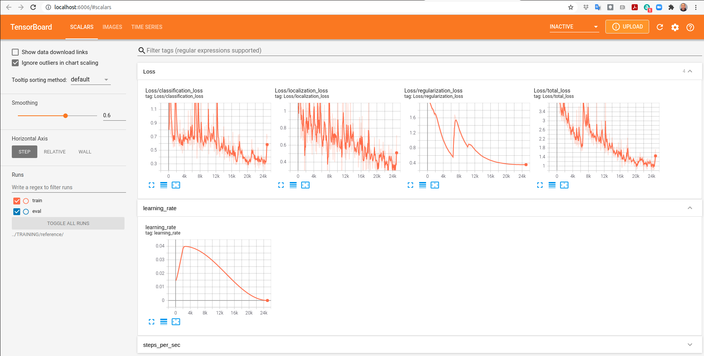
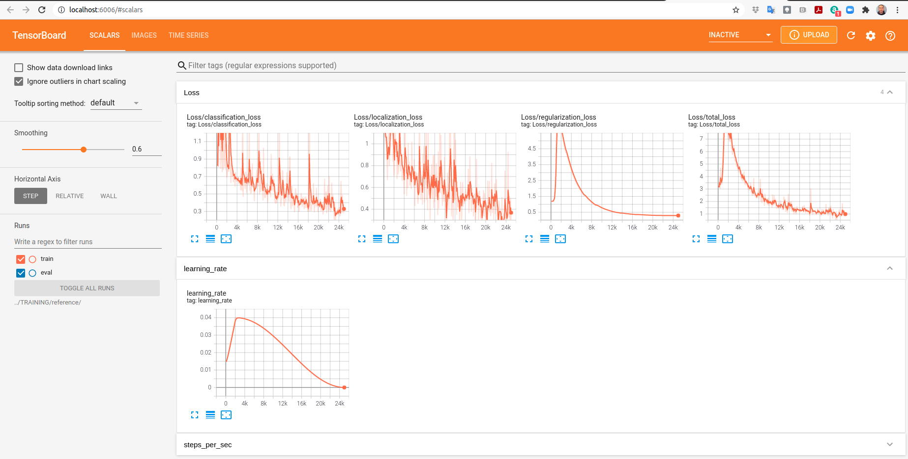
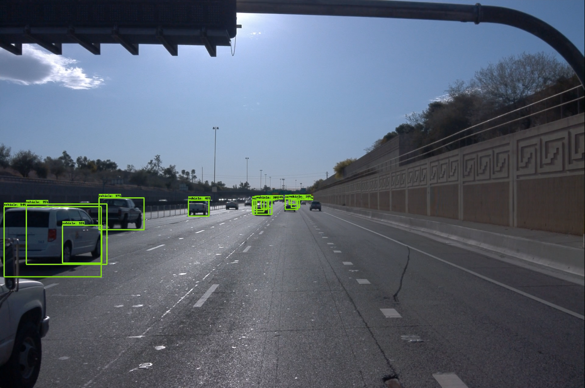
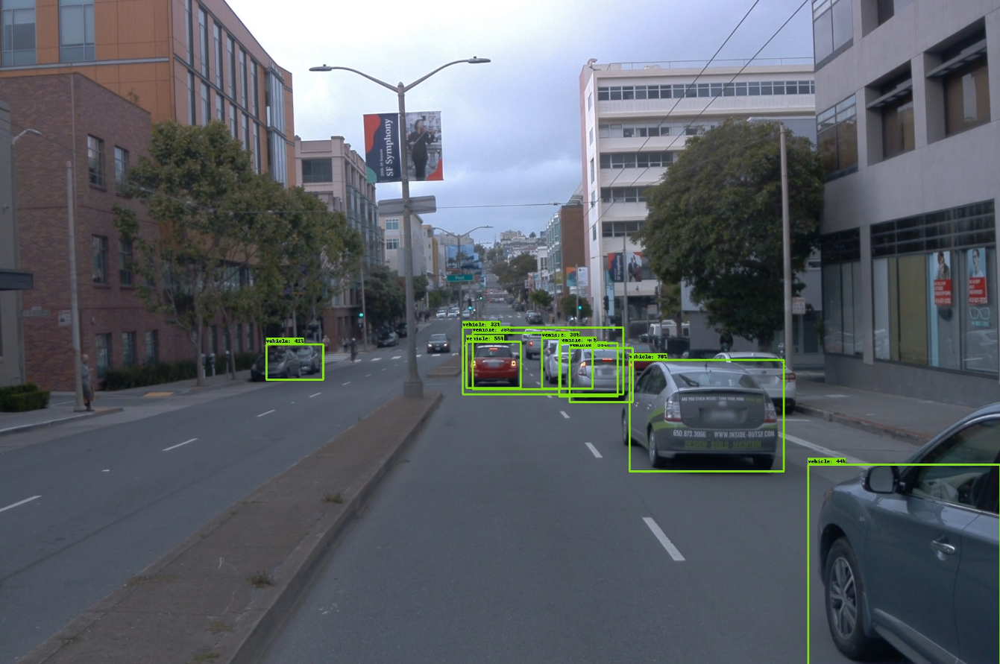

# Object detection in an Urban Environment

**Self-Driving Car Engineer Nanodegree<br/>
https://www.udacity.com/course/self-driving-car-engineer-nanodegree--nd0013**

## Submission Template


### Project overview

(This section should contain a brief description of the project and what we are trying to achieve. Why is object detection such an important component of self driving car systems?)

This project detects objects in camera videos.
Object detection is different from image classification because it is a more complex process.
Image classification selects the category that best describes an image.
Whereas object detection searches for many objects in the field of view and classifies
the objects detected.

Object detection in camera videos is an important component of self-driving cars systems 
because other sensors like lidars and radars don't have enough resolution to 
accurately detect and classify objects in the environment. Hence, object detection 
in camera videos makes self-driving cars better understand their environment
in which they are driving autonomously.

### Set up

(This section should contain a brief description of the steps to follow to run the code for this repository.)

#### Infrastructure Installation

You can avoid using nvidia-docker which is problematic.
You can install all the required software directly on an Ubuntu machine with a
modern GPU. Udacity workspaces have an Ubuntu machine with a
modern GPU. So, it is recommended to follow these instructions to install all
the required software in an Ubuntu machine with a modern GPU.

Some of these instructions were copied and pasted from the file 
[build/Dockerfile.gpu](build/Dockerfile.gpu).

```
conda create --name tensorflow-gpu python=3.6.9

conda activate tensorflow-gpu

sudo apt-get update --fix-missing

sudo apt-get install -y ffmpeg git git-core g++ pkg-config python3-pip unzip vim wget zip zlib1g-dev

pip install tensorflow-gpu==2.1.0

# This command must be executed in the directory "Object_Detection_in_Urban_Environment/build"
pip3 install -r requirements.txt

pip3 install git+https://github.com/philferriere/cocoapi.git#subdirectory=PythonAPI

export TF_CPP_MIN_LOG_LEVEL=2
```

The following commands should be executed outside of the github project directory.
(Type `cd ../..`)

``` 
wget https://github.com/protocolbuffers/protobuf/releases/download/v3.13.0/protoc-3.13.0-linux-x86_64.zip

unzip protoc-3.13.0-linux-x86_64.zip -d protobuf/

export PATH="$PATH:$PWD/protobuf/bin"


git clone https://github.com/tensorflow/models.git

cd models/research/

protoc object_detection/protos/*.proto --python_out=.

cp object_detection/packages/tf2/setup.py .

python -m pip install .
```

The last command causes this error:

```
ERROR: pip's dependency resolver does not currently take into account all the packages that are installed. This behaviour is the source of the following dependency conflicts.
tensorflow-gpu 2.1.0 requires gast==0.2.2, but you have gast 0.4.0 which is incompatible.
tensorflow-gpu 2.1.0 requires tensorboard<2.2.0,>=2.1.0, but you have tensorboard 2.5.0 which is incompatible.
tensorflow-gpu 2.1.0 requires tensorflow-estimator<2.2.0,>=2.1.0rc0, but you have tensorflow-estimator 2.5.0 which is incompatible.
```

In the end, you should go to the project directory and execute this test to 
guarantee that the GPU is being used and accelerates matrix multiplication.

```
python two_benchmarks.py 

tf.config.list_physical_devices('GPU'): [PhysicalDevice(name='/physical_device:GPU:0', device_type='GPU')]

Benchmark: Matrix Multiplication (10000, 10000) x (10000, 10000)
Device: /gpu:0.
tf.Tensor(250005620000.0, shape=(), dtype=float32)
Time taken: 0:00:01.725464

Benchmark: Matrix Multiplication (10000, 10000) x (10000, 10000)
Device: /cpu:0.
tf.Tensor(250054100000.0, shape=(), dtype=float32)
Time taken: 0:00:28.153059
```

If the test above is not passed, you should install `tensorflow-gpu 2.1.0` again
with this command:
`pip install tensorflow-gpu==2.1.0`. The test is passed when the Python script
`two_benchmarks.py` detects the GPU and the matrix multiplication is done by the
GPU in less than 2 seconds. Make sure that the test is passed. Otherwise you
won't be able to train the neural network.

#### Project Installation

Clone the github repository of this project:

```
git clone https://github.com/jckuri/Object_Detection_in_Urban_Environment.git
```

Install `gcloud` by running the commands: `curl https://sdk.cloud.google.com | bash` and `gcloud auth login`. Then, download the dataset by running this command `sh run_download_process.sh`. Split the dataset by running this command `sh run_create_splits.sh`.

Alternatively, you can skip the previous instructions in the last paragraph by executing this command `sh download_dataset.sh` or by cloning the github repository of the dataset outside of the project directory: 
```
git clone https://github.com/jckuri/Object_Detection_in_Urban_Environment_DATASET.git
```

It is up to you where you put the dataset directory and the training directory.
However, you must configure the file `set_data_and_training_dirs.sh` with the corresponding directories.
So, the environmental variables `$DATA_DIR` and `$TRAINING_DIR` in the file 
`set_data_and_training_dirs.sh` match with the dataset directory and the 
training directory.

```
$ cat set_data_and_training_dirs.sh 
export DATA_DIR=../DATA
export TRAINING_DIR=../TRAINING
echo "DATA_DIR=$DATA_DIR"
echo "TRAINING_DIR=$TRAINING_DIR"
```

After correctly configuring the dataset directory and the training directory,
you must execute the command:

```
$ source set_data_and_training_dirs.sh 
DATA_DIR=../DATA
TRAINING_DIR=../TRAINING
```

Execute the command `sh clean_training_dir.sh` in order to create the directory `$TRAINING_DIR` and copy the pretrained model.


Execute the command `sh run_edit_config.sh` in order to edit the configuration
file `pipeline_new.config` and to copy it to the directory `$TRAINING_DIR`.


Execute the command `sh run_model_main_tf2_training.sh` in order to train the model.
Execute the command `sh run_model_main_tf2_evaluation.sh` in order to evaluate the model while it is being trained.
Execute the command `sh run_tensorboard.sh` in order to monitor the tranining and evaluating processes.


Execute the command `sh run_exporter_main_v2.sh` in order to export the recently trained model.
Execute the command `sh run_many_inference_videos.sh` in order to render the videos in the test dataset.


Execute the command `sh pylint.sh` in order to show the PEP8 score of the code:
```
$ sh pylint.sh 
************* Module download_process
download_process.py:28:0: R0914: Too many local variables (21/15) (too-many-locals)
download_process.py:105:10: W1510: Using subprocess.run without explicitly set `check` is not recommended. (subprocess-run-check)
************* Module inference_video
inference_video.py:19:0: R0914: Too many local variables (24/15) (too-many-locals)

------------------------------------------------------------------
Your code has been rated at 9.92/10 (previous run: 9.92/10, +0.00)
```


Finally, you have many shell scripts to execute the main actions of this project.
The names of the scripts are very informative.

```
$ ls *.sh
autopep8.sh
git_push.sh
run_create_splits.sh
run_edit_config.sh
run_inference_video.sh
run_model_main_tf2_evaluation.sh
run_tensorboard.sh
clean_training_dir.sh
pylint.sh
run_download_process.sh
run_exporter_main_v2.sh
run_many_inference_videos.sh
run_model_main_tf2_training.sh
set_data_and_training_dirs.sh
download_dataset.sh
```

### Dataset

#### Dataset analysis

(This section should contain a quantitative and qualitative description of the dataset. It should include images, charts and other visualizations.)

You can see the Exploratory Data Analysis (EDA) in this Jupyter notebook:
[Exploratory%20Data%20Analysis.ipynb](Exploratory%20Data%20Analysis.ipynb)

Basically, this dataset contains many `.tfrecord` files.
And each `.tfrecord` file is a collection of annotated videos with multiple sensors:
Many cameras, many lidars, and radars.

For the sake of simplicity, in this project we only analyze 1 camera.
So, we drastically reduced the complexity of the original `.tfrecord` files.
The simpler versions of the `.tfrecord` files only have 1 annotated camera video
with many annotated frames.

Here is an example of an annotated frame:


After doing a long analysis of a big enough sample of annotated frames, the 
following statistics were obtained:


The stereotypical sizes of cars, bikes, and pedestrians matches our common sense.

However, the amount of bikes in this dataset is very low. So, this fact was 
considered in the cross validation strategy.

#### Cross validation

(This section should detail the cross validation strategy and justify your approach.)

In the Python script `create_splits.py`, I programmed the cross validation strategy.
In summary, given that the amount of bikes in the videos is very low, less than `1%`
of the objects, I decided to separate the `.tfrecord` files with bikes and without bikes.

From the `.tfrecord` files with bikes, I sampled the dataset with the proportions:
Training dataset `70%`, cross-validation dataset `15%`, and test dataset `15%`.

From the `.tfrecord` files without bikes, I sampled the dataset with the proportions:
Training dataset `70%`, cross-validation dataset `15%`, and test dataset `15%`.

In this way, it is guaranteed that all the datasets will contain bikes.
And here are the resulting datasets:

https://github.com/jckuri/Object_Detection_in_Urban_Environment_DATASET

### Training 

#### Reference experiment

(This section should detail the results of the reference experiment. It should includes training metrics and a detailed explanation of the algorithm's performances.)

Fortunately, I managed to configure tensorflow-gpu in my Ubuntu machine with an
NVidia GPU, after overcoming tons of problems. Configuring tensorflow-gpu and
making it work in my GPU was the hardest part of this project.

However, my GPU only has 3 Gb of memory. And I had to do many memory-saving tricks
to train this neural network.

First, I used this piece of code within the following link in order to avoid loading
many stuff at the GPU initialization.

```
import tensorflow as tf
physical_devices = tf.config.experimental.list_physical_devices('GPU')
if len(physical_devices) > 0:
    tf.config.experimental.set_memory_growth(physical_devices[0], True)
```

**Tensorflow GPU memory allocation<br/>**
https://stackoverflow.com/questions/65493824/tensorflow-gpu-memory-allocation

Second, I set the batch size to `1`.

Third, I could not start the evaluation thread due to the GPU memory constraints.
And that's why I could not show the validation loss in the following graphs.

I also run this project in the Udacity workspace and I could not show the 
validation loss in the TensorBoard graphs. I even reported this problem to 
the Knowledge Platform and I have no answer yet after many days:

**Tensorboard shows training runs. But evaluation runs are not shown.<br/>
https://knowledge.udacity.com/questions/662724**

**Tensorboard Visualization of Training with the Baseline Experiment:<br/>**


The training loss is evolving well, except for the sudden and abrupt increase
in the regularization loss.

In the end, this experiment produced decent results. Look at the following video demos:
[#video-demos-with-baseline-detections-and-enhanced-detections](#video-demos-with-baseline-detections-and-enhanced-detections)

#### Improve on the reference

(This section should highlight the different strategies you adopted to improve your model. It should contain relevant figures and details of your findings.)

From this list <https://github.com/tensorflow/models/blob/master/research/object_detection/protos/preprocessor.proto>,
I used the following data augmentation strategies in order to make pattern recognition more invariant and overcome
overfitting:

- `random_crop_image`
- `random_horizontal_flip`
- `random_adjust_brightness`
- `random_adjust_contrast`
- `random_adjust_hue`
- `random_adjust_saturation`
- `random_image_scale`
- `random_rgb_to_gray`

And here is the code I added to the original file `pipeline.config`:

```
  data_augmentation_options {
    random_crop_image {
      min_object_covered: 0.0
      min_aspect_ratio: 0.75
      max_aspect_ratio: 3.0
      min_area: 0.75
      max_area: 1.0
      overlap_thresh: 0.0
    }
  }
  data_augmentation_options {
    random_horizontal_flip {
      probability: 0.5
    }
  }
  data_augmentation_options {
    random_adjust_brightness {
      max_delta: 0.1
    }
  }
  data_augmentation_options {
    random_adjust_contrast {
      min_delta: 0.9
      max_delta: 1.1
    }
  }
  data_augmentation_options {
    random_adjust_hue {
      max_delta: 0.1
    }
  }
  data_augmentation_options {
    random_adjust_saturation {
      min_delta: 0.9
      max_delta: 1.1
    }
  }
  data_augmentation_options {
    random_image_scale {
      min_scale_ratio: 0.9
      max_scale_ratio: 1.1
    }
  }
  data_augmentation_options {
    random_rgb_to_gray {
      probability: 0.1
    }
  }
```

The data augmentation strategies produced a better learning curve with lower
losses and its evolution was more stable through time than the previous experiment.

**Tensorboard Visualization of Training with the Enhanced Experiment:<br/>**



And you can see how the data augmentation strategies improved the object detection
in the video demos:
[#video-demos-with-baseline-detections-and-enhanced-detections](#video-demos-with-baseline-detections-and-enhanced-detections)


Again, I could not show the validation loss in the TensorBoard graphs due to
the problem I reported in the Knowledge Platform without answer yet after many days:

**Tensorboard shows training runs. But evaluation runs are not shown.<br/>
https://knowledge.udacity.com/questions/662724**


#### Video Demos with Baseline Detections and Enhanced Detections


| segment-10075870402459732738_1060_000_1080_000_with_camera_labels.tfrecord   |
|---|
| Demo with baseline detections  |
| [baseline_detection_videos/segment-10075870402459732738_1060_000_1080_000_with_camera_labels.tfrecord.mp4](baseline_detection_videos/segment-10075870402459732738_1060_000_1080_000_with_camera_labels.tfrecord.mp4)  |
| Demo with enhanced detections  |
| [enhanced_detection_videos/segment-10075870402459732738_1060_000_1080_000_with_camera_labels.tfrecord.mp4](enhanced_detection_videos/segment-10075870402459732738_1060_000_1080_000_with_camera_labels.tfrecord.mp4)  |


| segment-10664823084372323928_4360_000_4380_000_with_camera_labels.tfrecord   |
|---|
| Demo with baseline detections  |
| [baseline_detection_videos/segment-10664823084372323928_4360_000_4380_000_with_camera_labels.tfrecord.mp4](baseline_detection_videos/segment-10664823084372323928_4360_000_4380_000_with_camera_labels.tfrecord.mp4)  |
| Demo with enhanced detections  |
| [enhanced_detection_videos/segment-10664823084372323928_4360_000_4380_000_with_camera_labels.tfrecord.mp4](enhanced_detection_videos/segment-10664823084372323928_4360_000_4380_000_with_camera_labels.tfrecord.mp4)  |


| segment-10770759614217273359_1465_000_1485_000_with_camera_labels.tfrecord   |
|---|
| Demo with baseline detections  |
| [baseline_detection_videos/segment-10770759614217273359_1465_000_1485_000_with_camera_labels.tfrecord.mp4](baseline_detection_videos/segment-10770759614217273359_1465_000_1485_000_with_camera_labels.tfrecord.mp4)  |
| Demo with enhanced detections  |
| [enhanced_detection_videos/segment-10770759614217273359_1465_000_1485_000_with_camera_labels.tfrecord.mp4](enhanced_detection_videos/segment-10770759614217273359_1465_000_1485_000_with_camera_labels.tfrecord.mp4)  |


| segment-10940952441434390507_1888_710_1908_710_with_camera_labels.tfrecord   |
|---|
| Demo with baseline detections  |
| [baseline_detection_videos/segment-10940952441434390507_1888_710_1908_710_with_camera_labels.tfrecord.mp4](baseline_detection_videos/segment-10940952441434390507_1888_710_1908_710_with_camera_labels.tfrecord.mp4)  |
| Demo with enhanced detections  |
| [enhanced_detection_videos/segment-10940952441434390507_1888_710_1908_710_with_camera_labels.tfrecord.mp4](enhanced_detection_videos/segment-10940952441434390507_1888_710_1908_710_with_camera_labels.tfrecord.mp4)  |


| segment-11113047206980595400_2560_000_2580_000_with_camera_labels.tfrecord   |
|---|
| Demo with baseline detections  |
| [baseline_detection_videos/segment-11113047206980595400_2560_000_2580_000_with_camera_labels.tfrecord.mp4](baseline_detection_videos/segment-11113047206980595400_2560_000_2580_000_with_camera_labels.tfrecord.mp4)  |
| Demo with enhanced detections  |
| [enhanced_detection_videos/segment-11113047206980595400_2560_000_2580_000_with_camera_labels.tfrecord.mp4](enhanced_detection_videos/segment-11113047206980595400_2560_000_2580_000_with_camera_labels.tfrecord.mp4)  |


| segment-11183906854663518829_2294_000_2314_000_with_camera_labels.tfrecord   |
|---|
| Demo with baseline detections  |
| [baseline_detection_videos/segment-11183906854663518829_2294_000_2314_000_with_camera_labels.tfrecord.mp4](baseline_detection_videos/segment-11183906854663518829_2294_000_2314_000_with_camera_labels.tfrecord.mp4)  |
| Demo with enhanced detections  |
| [enhanced_detection_videos/segment-11183906854663518829_2294_000_2314_000_with_camera_labels.tfrecord.mp4](enhanced_detection_videos/segment-11183906854663518829_2294_000_2314_000_with_camera_labels.tfrecord.mp4)  |


| segment-11839652018869852123_2565_000_2585_000_with_camera_labels.tfrecord   |
|---|
| Demo with baseline detections  |
| [baseline_detection_videos/segment-11839652018869852123_2565_000_2585_000_with_camera_labels.tfrecord.mp4](baseline_detection_videos/segment-11839652018869852123_2565_000_2585_000_with_camera_labels.tfrecord.mp4)  |
| Demo with enhanced detections  |
| [enhanced_detection_videos/segment-11839652018869852123_2565_000_2585_000_with_camera_labels.tfrecord.mp4](enhanced_detection_videos/segment-11839652018869852123_2565_000_2585_000_with_camera_labels.tfrecord.mp4)  |


| segment-11940460932056521663_1760_000_1780_000_with_camera_labels.tfrecord   |
|---|
| Demo with baseline detections  |
| [baseline_detection_videos/segment-11940460932056521663_1760_000_1780_000_with_camera_labels.tfrecord.mp4](baseline_detection_videos/segment-11940460932056521663_1760_000_1780_000_with_camera_labels.tfrecord.mp4)  |
| Demo with enhanced detections  |
| [enhanced_detection_videos/segment-11940460932056521663_1760_000_1780_000_with_camera_labels.tfrecord.mp4](enhanced_detection_videos/segment-11940460932056521663_1760_000_1780_000_with_camera_labels.tfrecord.mp4)  |


--------------------------------------------------------------------------------
--------------------------------------------------------------------------------

## Data

For this project, we will be using data from the [Waymo Open dataset](https://waymo.com/open/). The files can be downloaded directly from the website as tar files or from the [Google Cloud Bucket](https://console.cloud.google.com/storage/browser/waymo_open_dataset_v_1_2_0_individual_files/) as individual tf records. 

## Structure

The data in the classroom workspace will be organized as follows:
```
/home/backups/
    - raw: contained the tf records in the Waymo Open format. (NOTE: this folder only contains temporary files and should be empty after running the download and process script)

/home/workspace/data/
    - processed: contained the tf records in the Tf Object detection api format. (NOTE: this folder should be empty after creating the splits)
    - test: contain the test data
    - train: contain the train data
    - val: contain the val data
```

The experiments folder will be organized as follow:
```
experiments/
    - exporter_main_v2.py: to create an inference model
    - model_main_tf2.py: to launch training
    - experiment0/....
    - experiment1/....
    - experiment2/...
    - pretrained-models/: contains the checkpoints of the pretrained models.
```

## Prerequisites

### Local Setup

For local setup if you have your own Nvidia GPU, you can use the provided Dockerfile and requirements in the [build directory](./build).

Follow [the README therein](./build/README.md) to create a docker container and install all prerequisites.

### Classroom Workspace

In the classroom workspace, every library and package should already be installed in your environment. However, you will need to login to Google Cloud using the following command:
```
gcloud auth login
```
This command will display a link that you need to copy and paste to your web browser. Follow the instructions. You can check if you are logged correctly by running :
```
gsutil ls gs://waymo_open_dataset_v_1_2_0_individual_files/
```
It should display the content of the bucket.

## Instructions

### Download and process the data

The first goal of this project is to download the data from the Waymo's Google Cloud bucket to your local machine. For this project, we only need a subset of the data provided (for example, we do not need to use the Lidar data). Therefore, we are going to download and trim immediately each file. In `download_process.py`, you will need to implement the `create_tf_example` function. This function takes the components of a Waymo Tf record and save them in the Tf Object Detection api format. An example of such function is described [here](https://tensorflow-object-detection-api-tutorial.readthedocs.io/en/latest/training.html#create-tensorflow-records). We are already providing the `label_map.pbtxt` file. 

Once you have coded the function, you can run the script at using
```
python download_process.py --data_dir /home/workspace/data/ --temp_dir /home/backups/
```

You are downloading XX files so be patient! Once the script is done, you can look inside the `/home/workspace/data/processed` folder to see if the files have been downloaded and processed correctly.


### Exploratory Data Analysis

Now that you have downloaded and processed the data, you should explore the dataset! This is the most important task of any machine learning project. To do so, open the `Exploratory Data Analysis` notebook. In this notebook, your first task will be to implement a `display_instances` function to display images and annotations using `matplotlib`. This should be very similar to the function you created during the course. Once you are done, feel free to spend more time exploring the data and report your findings. Report anything relevant about the dataset in the writeup.

Keep in mind that you should refer to this analysis to create the different spits (training, testing and validation). 


### Create the splits

Now you have become one with the data! Congratulations! How will you use this knowledge to create the different splits: training, validation and testing. There are no single answer to this question but you will need to justify your choice in your submission. You will need to implement the `split_data` function in the `create_splits.py` file. Once you have implemented this function, run it using:
```
python create_splits.py --data_dir /home/workspace/data/
```

NOTE: Keep in mind that your storage is limited. The files should be <ins>moved</ins> and not copied. 

### Edit the config file

Now you are ready for training. As we explain during the course, the Tf Object Detection API relies on **config files**. The config that we will use for this project is `pipeline.config`, which is the config for a SSD Resnet 50 640x640 model. You can learn more about the Single Shot Detector [here](https://arxiv.org/pdf/1512.02325.pdf). 

First, let's download the [pretrained model](http://download.tensorflow.org/models/object_detection/tf2/20200711/ssd_resnet50_v1_fpn_640x640_coco17_tpu-8.tar.gz) and move it to `training/pretrained-models/`. 

Now we need to edit the config files to change the location of the training and validation files, as well as the location of the label_map file, pretrained weights. We also need to adjust the batch size. To do so, run the following:
```
python edit_config.py --train_dir /home/workspace/data/train/ --eval_dir /home/workspace/data/val/ --batch_size 4 --checkpoint ./training/pretrained-models/ssd_resnet50_v1_fpn_640x640_coco17_tpu-8/checkpoint/ckpt-0 --label_map label_map.pbtxt
```
A new config file has been created, `pipeline_new.config`.

### Training

You will now launch your very first experiment with the Tensorflow object detection API. Create a folder `training/reference`. Move the `pipeline_new.config` to this folder. You will now have to launch two processes: 
* a training process:
```
python model_main_tf2.py --model_dir=training/reference/ --pipeline_config_path=training/reference/pipeline_new.config
```
* an evaluation process:
```
python model_main_tf2.py --model_dir=training/reference/ --pipeline_config_path=training/reference/pipeline_new.config --checkpoint_dir=training/reference/
```

NOTE: both processes will display some Tensorflow warnings.

To monitor the training, you can launch a tensorboard instance by running `tensorboard --logdir=training`. You will report your findings in the writeup. 

### Improve the performances

Most likely, this initial experiment did not yield optimal results. However, you can make multiple changes to the config file to improve this model. One obvious change consists in improving the data augmentation strategy. The [`preprocessor.proto`](https://github.com/tensorflow/models/blob/master/research/object_detection/protos/preprocessor.proto) file contains the different data augmentation method available in the Tf Object Detection API. To help you visualize these augmentations, we are providing a notebook: `Explore augmentations.ipynb`. Using this notebook, try different data augmentation combinations and select the one you think is optimal for our dataset. Justify your choices in the writeup. 

Keep in mind that the following are also available:
* experiment with the optimizer: type of optimizer, learning rate, scheduler etc
* experiment with the architecture. The Tf Object Detection API [model zoo](https://github.com/tensorflow/models/blob/master/research/object_detection/g3doc/tf2_detection_zoo.md) offers many architectures. Keep in mind that the `pipeline.config` file is unique for each architecture and you will have to edit it. 


### Creating an animation
#### Export the trained model
Modify the arguments of the following function to adjust it to your models:
```
python .\exporter_main_v2.py --input_type image_tensor --pipeline_config_path training/experiment0/pipeline.config --trained_checkpoint_dir training/experiment0/ckpt-50 --output_directory training/experiment0/exported_model/
```

Finally, you can create a video of your model's inferences for any tf record file. To do so, run the following command (modify it to your files):
```
python inference_video.py -labelmap_path label_map.pbtxt --model_path training/experiment0/exported_model/saved_model --tf_record_path /home/workspace/data/test/tf.record --config_path training/experiment0/pipeline_new.config --output_path animation.mp4
```

